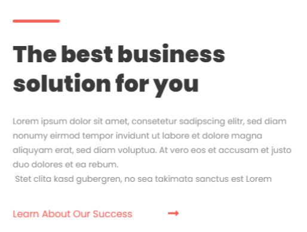
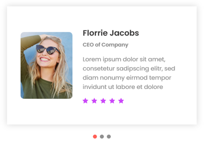
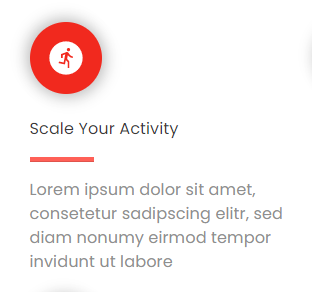
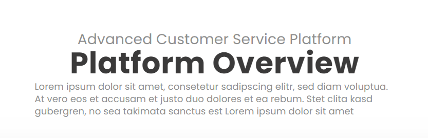
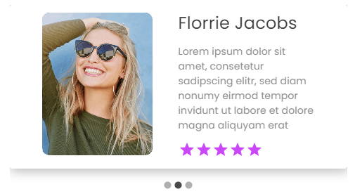
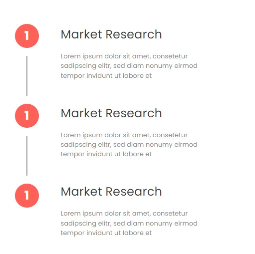

# stevdy-business-solutions-task

## This project builde using:
 - [ReactJS](https://reactjs.org/)
 - [MaterialUI](https://mui.com/material-ui/getting-started/installation/)

## Links:
 - [Project Code On GitHub](https://github.com/mahmoud-sayed/stevdy-business-solutions-task)
 - [Open Project Online](https://mahmoud-sayed.github.io/stevdy-business-solutions-task)

## design built with
 - material UI
 - react-countup
 - react-material-ui-carousel
 - icons-material

## important nots
 - this design have be cerated in 6 hours: I was facing Issus handling image sizing in the back ground
 - I can make this design better than that but I need more time
 - the design not done yet

## you can look at this designs I already create 

freelancers-gate is a freelancing platform same like freelancer website
 - [freelancers-Gate](https://github.com/mahmoud-sayed/freelancers-gate)

Shoes-Shop is a mobile app built with react native I just learn it in the last 2 weeks
 - [Shoes-Shop](https://github.com/mahmoud-sayed/Shoes-Shop)

## steps I'm making it now after delivering the task
 - refactor the code to make it look better and shorter 
 - create reusable components for better code structure
 - make the design better and more responsive
 - create the missing things

## Changes I have made to the project

&nbsp;

  -  create component for this part so I can use It without reWrite the code
  

&nbsp;

  - create new theme and add it to the MUI theming so I can use it all around the project if needed [Click Here](https://mui.com/material-ui/customization/theming/) so you can review the step on Docs

&nbsp;

 - created data file to hold the data

 &nbsp;

 - create component for testimonials
  

 &nbsp;

 - Created component for services
 

 &nbsp;

 - centered this section 
  

 &nbsp;

 - Changed starts color in testimonials card
  

&nbsp;

 - done creating market research section
  

&nbsp;

 - fixed the footer scalability

&nbsp;

 - in XL screen all sections changed to become wider

&nbsp;

 - change the all fonts sizes to fit all screens

&nbsp;

- 